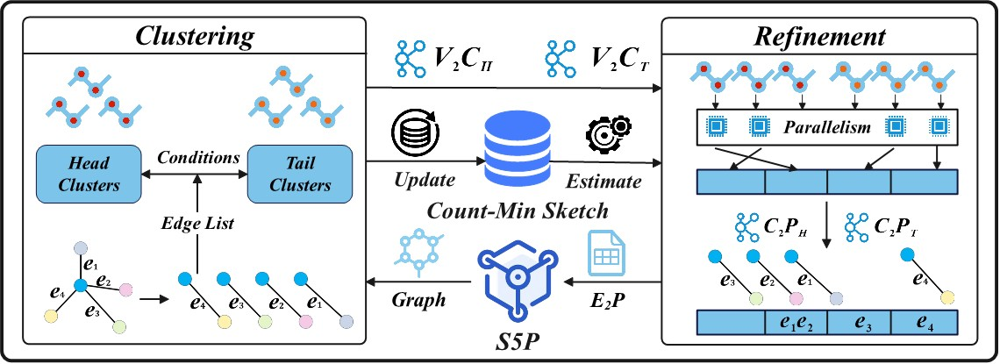

# Skewness-aware Vertex-cut Partitioner (S5P)

<span style="color: red;">**We will maintain this code in this [repository](https://github.com/USTC-DataDarknessLab/S5P) moving forward.**</span>

The implementation of S5P a skewness-aware vertex-cut partitioner. The work is published at ACM SIGMOD 2024.</br>
Please cite the paper as follows:</br>
>Zezhong Ding, Yongan Xiang, Shangyou Wang, Xike Xie, S. Kevin Zhou. “Play like a Vertex: A Stackelberg Game Approach for Streaming Graph Partitioning”. In Proceedings of the 2024 International Conference on Management of Data (SIGMOD ‘24). <https://dl.acm.org/doi/10.1145/3654965>


<p align="center">
  
</p>

## Installation
We tested the program (main) on Ubuntu 20.046 LTS.

The programs require the below packages: `g++`, `cmake`, `glog`, `gflags`, `boost`:
```
sudo apt-get install libgoogle-glog-dev libgflags-dev libboost-all-dev cmake g++
```

## Build Programs
```
#C++
cd cpp
mkdir build && cd build
cmake ..
make
```

```
#java
cd Java
#Details in Java Folder
```

## Usage
Parameters:
* `filename(inputGraphPath)`: path to the edge list file
* `Vcount`: $|V|$
* `Ecount`: $|E|$
* `batchsize`: default: 1000
* `the number of partitions`: $partitionNum$
* `Skewness coefficient`: $\tau$($\beta$)

## Data sets used in the paper
* OK: https://snap.stanford.edu/data/com-Orkut.html
* TW: https://snap.stanford.edu/data/twitter-2010.html
* FR: https://snap.stanford.edu/data/com-Friendster.html
* LJ: https://snap.stanford.edu/data/com-LiveJournal.html
* IT: http://law.di.unimi.it/webdata/it-2004/
* UK7: http://law.di.unimi.it/webdata/uk-2007-05/
* IN: https://law.di.unimi.it/webdata/in-2004/
* SK: https://law.di.unimi.it/webdata/sk-2005/
* UK2: https://law.di.unimi.it/webdata/uk-2002/
* AR: https://law.di.unimi.it/webdata/arabic-2005/
* WB: https://law.di.unimi.it/webdata/webbase-2001/
* Synthetic Graphs (R-MAT/TrillionG): https://github.com/chan150/TrillionG (SIGMOD'17)

## Citation

```
@article{10.1145/3654965,
author = {Ding, Zezhong and Xiang, Yongan and Wang, Shangyou and Xie, Xike and Zhou, S. Kevin},
title = {Play like a Vertex: A Stackelberg Game Approach for Streaming Graph Partitioning},
year = {2024},
issue_date = {June 2024},
publisher = {Association for Computing Machinery},
address = {New York, NY, USA},
volume = {2},
number = {3},
url = {https://doi.org/10.1145/3654965},
doi = {10.1145/3654965},
journal = {Proc. ACM Manag. Data},
month = {may},
articleno = {162},
numpages = {27},
keywords = {distributed systems, graph partitioning, streaming partitioning}
}
```

